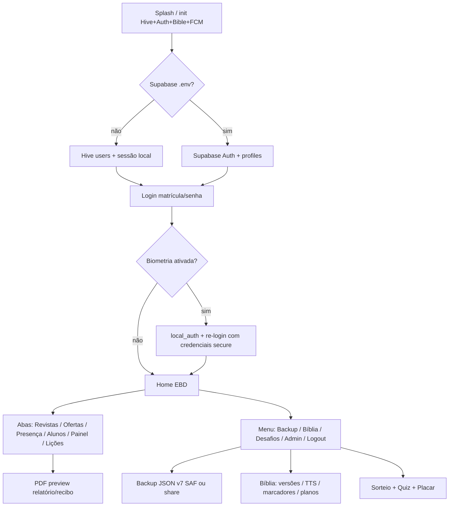

# Auditoria de fluxo completo — EBD (`livro_registro`)

**Data:** 2026-08-02  
**Escopo:** auth → home → backup → bíblia → desafios → cloud → multiplataforma → qualidade  
**Método:** leitura de `docs/*` + inspeção do código em `lib/`, `supabase/`, `assets/quiz/`; ADB sem device anexado (smoke opcional não executado).  
**Modo observado no workspace:** `.env` com Supabase/Firebase **não configurados** (app cai no Hive local / demo `admin`/`admin123`).

## Resumo executivo

O app Android offline-first está **funcionalmente rico** no aparelho: login local, roles/overrides, abas do livro de registro, classes custom, PDF com preview, backup SAF v7 (inclui engagement + users), Bíblia (Almeida 1819 embutida + Midvash/API), Desafios (sorteio/quiz ~1033 questões/placar) e “Trouxe Bíblia” na presença. Os gaps que ainda **quebram a visão de plataforma** estão no **cloud**: schema Supabase existe, mas `AppState` **nunca** lê/escreve essas tabelas; admin de usuários no Supabase está incompleto (edição/reset já bloqueados; criação via `signUp` era perigosa — agora bloqueada); FCM/`birthday-push` não enviam push real; Edge `sync-betel` não é chamada pelo app (sync é scrape client-side). Web/iOS seguem parciais (restore só Android; iOS sem signing). Qualidade: orientation lock ok, overflows mitigados em partes, testes quase só unitários de modelo.

## Mapa do fluxo feliz

Fluxo operacional típico (Android, modo local):

1. Login (lembrar matrícula; opcional biometria).
2. Selecionar turma → presença (+ Trouxe Bíblia) / revistas / ofertas / alunos.
3. Menu → Lições/Betel (sync HTML) → cadastrar 13 lições.
4. Relatório PDF ou recibo de oferta (preview → compartilhar/imprimir).
5. Backup JSON para Drive/pasta; restore no outro aparelho Android.
6. Bíblia EBD + Desafios (quiz/placar) no mesmo aparelho.

## Tabela de gaps

| ID | Área | Severidade | Descrição | Impacto | Como fechar |
|---|---|---|---|---|---|
| G01 | Cloud / Sync | **P0** | Dados EBD (`students`, `attendance`, `finances`, `editions`, `lessons`, etc.) vivem só no Hive/`AppState`. Não há cliente Flutter que faça upsert/select nas tabelas da migration. | Multi-dispositivo e “backend pronto” são ilusão: cada aparelho é silo; cloud schema ocioso. | Serviço `EbdCloudSync` (pull/push + conflito) ligando `AppState` ↔ Supabase; começar por students/attendance/finances; RLS já parcialmente definida. |
| G02 | Cloud / Auth admin | **P0** | Com Supabase: `updateUser` / `resetUserPassword` já lançam erro; `createUser` via `signUp` **trocava a sessão do admin** (corrigido em 2026-08-02: agora bloqueia com mensagem). `UsersAdminScreen` lista só Hive (`listLocalUsers`). Schema **não tem** coluna `permission_overrides`. | Admin cloud inviável pelo app; overrides granulares não persistem no Postgres. | Edge Function/API Admin (service role) para CRUD; `listProfiles` no Supabase; migration `permission_overrides jsonb`; UI dual local/cloud. |
| G03 | Cloud / FCM | **P0** | `birthday-push` só faz `console.log('Would push…')`. FCM no app depende de `FIREBASE_ENABLED` + `google-services.json`; workspace atual off. | Aniversários/notificações não chegam em produção. | Implementar FCM HTTP v1 na Edge Function + secrets Firebase; validar token em `fcm_tokens` no device. |
| G04 | Auth / Segurança | **P1** | Senhas locais em texto no Hive; biometria reusa `last_senha` no `FlutterSecureStorage`. | Compromisso do aparelho/backup de app data expõe credenciais. | Hash (bcrypt/argon2) no Hive; biometria com token de sessão de curta duração, não senha em claro. |
| G05 | Auth / Permissões | **P1** | Role **aluno** tem `editAttendance` e a aba Presença permite marcar **toda** a turma (sem filtro “só eu”). | Aluno pode adulterar chamada da classe. | Preset aluno: só self-check-in **ou** remover `editAttendance` do aluno; UI filtrar por `alunoId`/`matricula`. |
| G06 | Backup | **P1** | Restore nativo (SAF) só Android. Web/iOS: export via `share_plus`; `pickBackup` lança `UnsupportedError`. | Troca de plataforma / professor no browser não restaura. | `file_picker` + parse JSON no web/iOS; documentar fluxo Files/iCloud. |
| G07 | Cloud / Schema drift | **P1** | `attendance_people` na migration **não** tem `trouxe_biblia`; app local sim (`trouxeBiblia`). | Sync futuro perderia “Trouxe Bíblia”. | `ALTER TABLE … ADD trouxe_biblia boolean default false` + mapear no sync. |
| G08 | Betel | **P1** | App usa `BetelSyncService` (HTTP scrape no device). Edge `sync-betel` existe mas **não é invocada** pelo Flutter; catálogo cloud e local divergem. | Dois caminhos, manutenção dupla; scrape frágil a mudanças de HTML. | App chama Edge Function autenticada **ou** abandona a Edge e documenta só client; preferir Edge + leitura de `betel_catalog`. |
| G09 | Gamificação | **P1** | `GamificationEngine.deviceStudentId` não era passado na UI → pontos/badges de leitura/quiz **nunca** creditavam aluno. **Corrigido 2026-08-02** (match matrícula/nome). | Placar incompleto vs `docs/GAMIFICACAO.md`. | Validar no device: login = aluno com mesma matrícula; jogar quiz e ver pontos. Ainda falta matching robusto se nomes duplicados. |
| G10 | Bíblia / Licença | **P1** | ARA/RA/SBB/NTLH dependem de API Midvash (+ opcional API.Bible). Embutir no APK exige contrato. Almeida 1819 ok offline. | Offline “completo” das versões modernas só após download; risco de API indisponível. | Contrato SBB **ou** UX clara de “baixar Bíblia completa” + monitoramento Midvash; API.Bible em produção se houver chave. |
| G11 | Cloud / Storage | **P1** | Bucket `avatars` documentado; app não faz upload; fotos = path local (`FileImage` falha na web). | Fotos não sincronizam; web sem avatar. | Upload Storage + `foto_url`; na web usar NetworkImage/bytes. |
| G12 | Multiplataforma | **P1** | iOS: pasta/`Info.plist` ok; falta signing Apple, ícones validados, FCM/APNs, teste real de biometria/TTS/Hive. Web: shell max-width; FCM/biometria/SAF off; PWA básico. | Store iOS e paridade web bloqueadas. | Checklist `MULTIPLATAFORMA.md` em Mac + hosting web com `.env` prod. |
| G13 | Auth / UX | **P2** | “Esqueci a senha” menciona e-mail/telefone; local só gera senha temp; Supabase só e-mail (e `@ebd.local` não recebe). | Expectativa frustrada. | Copy honesta + exigir `profiles.email` real; SMS fora de escopo ou provedor. |
| G14 | Auth / Sessão | **P2** | Logout padrão **não** limpa biometria (`clearBiometric: false`). Lembrar-me só matrícula (ok). | Compartilhar aparelho: próximo usuário pode biometria do anterior se não “sair limpando”. | Opção “Sair e remover biometria” no menu; ou limpar em logout se multi-usuário. |
| G15 | Desafios | **P2** | Quiz bank ~1033 ok; placar/sorteio locais; sem sync cloud de scores/raffles. | Rankings não cross-device. | Incluir engagement no sync G01. |
| G16 | Qualidade / Testes | **P2** | `test/widget_test.dart` cobre backup/permissões/ScrollableFill; sem testes de integração auth/home/backup/bible. | Regressões fáceis. | Golden/smoke: login local, export/import backup v7, load chapter Almeida. |
| G17 | Qualidade / UI | **P2** | Portrait lock em `main.dart`; `ScrollableFill`/`ResponsiveShell` em várias telas; painel/algumas listas ainda densas mobile-first. | Overflow residual possível em landscape se lock falhar (tablet/web). | Auditar `DashboardView`/admin em janela baixa; mais `ScrollableFill`. |
| G18 | Admin / Produto | **P2** | Sem convites, auditoria de ações, dark mode, a11y priorizada. | Operação igreja grande fica manual. | Backlog pós-sync. |

### Fixes mínimos aplicados nesta auditoria

| Fix | Arquivo | Motivo |
|---|---|---|
| Bloquear `createUser` com Supabase | `lib/services/auth_service.dart` | Evita `signUp` derrubar sessão do admin |
| Ligar `deviceStudentId` no placar | `lib/features/engagement/gamification_tab.dart` | Créditos de quiz/leitura voltam a funcionar |

## O que já está sólido

- **Auth local:** seed admin, sessão Hive, lembrar matrícula, biometria Android/iOS (código), reset local determinístico.
- **Permissões:** `AppPermission` + presets + overrides (Hive); abas do Home filtradas; último admin protegido.
- **Home EBD:** 6 modos, chips de turma, classes custom (criar/remover), lição do dia, menu Desafios/Bíblia/Backup.
- **Presença + Trouxe Bíblia:** modelo + UI + pontos no engine.
- **PDF:** preview genérico (`PdfDocumentPreviewScreen`) para relatório e recibo.
- **Backup v7:** editions/records/finances/attendance/students/lessons/customGroups/engagement/users; SAF Android em `MainActivity`.
- **Bíblia:** catálogo 66 livros, asset DP, remote+cache, TTS settings, marcadores, planos, erros acionáveis.
- **Quiz:** `assets/quiz/questions.json` com **1033** questões carregadas por `QuizBank`.
- **Docs operacionais:** `SETUP_CLOUD`, `BIBLIA`, `PERMISSOES`, `GAMIFICACAO`, `MULTIPLATAFORMA`, `PENDENCIAS` alinhados em grande parte com o código (exceto otimismo implícito de “backend pronto”).

## Recomendação de ordem de ataque (próximos 5 passos)

1. **Decidir modo de produção:** continuar offline-first com backup JSON como “sync humano”, **ou** investir em G01 (sync Supabase). Sem essa decisão, cloud vira dívida eterna.
2. Se cloud: **fechar G02+G07** (admin via service role + colunas `permission_overrides` / `trouxe_biblia`) antes de ligar `.env` real em escala.
3. **G05** (aluno não edita chamada da turma) — risco operacional imediato mesmo offline.
4. **G06** restore web/iOS + validar backup v7 round-trip em CI (G16).
5. **G03** FCM real só depois de tokens estáveis no Android; Betel unificar em um caminho (G08).

## Referências cruzadas

- [`PENDENCIAS.md`](PENDENCIAS.md) — itens que dependem de licença/cloud  
- [`MULTIPLATAFORMA.md`](MULTIPLATAFORMA.md) — web/iOS  
- [`SETUP_CLOUD.md`](SETUP_CLOUD.md) — Supabase/Firebase (inclui aviso de birthday-push)  
- [`PERMISSOES.md`](PERMISSOES.md) · [`BIBLIA.md`](BIBLIA.md) · [`GAMIFICACAO.md`](GAMIFICACAO.md)  
- [`AUDITORIA_RECUPERACAO.md`](AUDITORIA_RECUPERACAO.md) — origem do APK  
)
