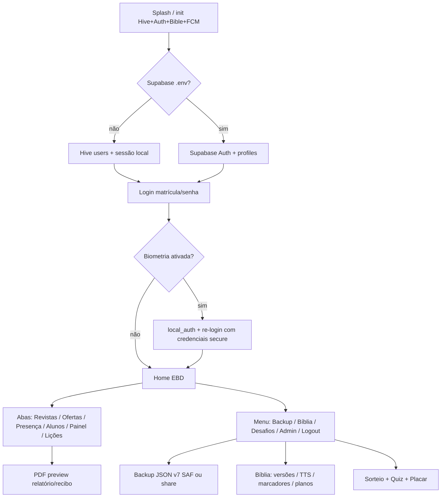

# Auditoria de fluxo completo — EBD (`livro_registro`)

**Data:** 2026-08-02  
**Escopo:** auth → home → backup → bíblia → desafios → cloud → multiplataforma → qualidade  
**Método:** leitura de `docs/*` + inspeção do código em `lib/`, `supabase/`, `assets/quiz/`; ADB sem device anexado (smoke opcional não executado).  
**Modo observado no workspace:** `.env` com Supabase/Firebase **não configurados** (app cai no Hive local / demo `admin`/`admin123`).

## Resumo executivo

O app Android offline-first está **funcionalmente rico** no aparelho: login local, roles/overrides, abas do livro de registro, classes custom, PDF com preview, backup SAF v7 (inclui engagement + users), Bíblia (Almeida 1819 embutida + Midvash/API), Desafios (sorteio/quiz ~1033 questões/placar) e “Trouxe Bíblia” na presença. **Atualização 2026-08-02 (pós-auditoria):** G05 (presença aluno), G02 (`admin-users`), G07 (migration schema), G01 (`CloudSyncService` mínimo + UI), G03 (FCM HTTP v1 / dry-run), G06 (restore `file_picker`), G04 parcial (hash senhas Hive) e G08 (Betel edge→fallback) foram fechados no código. Ainda dependem de deploy/secrets em produção: Edge Functions, migration no projeto Supabase, Firebase. Sync ainda não cobre lessons/delivery/engagement. iOS Store signing segue fora.

## Mapa do fluxo feliz

Fluxo operacional típico (Android, modo local):

1. Login (lembrar matrícula; opcional biometria).
2. Selecionar turma → presença (+ Trouxe Bíblia) / revistas / ofertas / alunos.
3. Menu → Lições/Betel (sync HTML) → cadastrar 13 lições.
4. Relatório PDF ou recibo de oferta (preview → compartilhar/imprimir).
5. Backup JSON para Drive/pasta; restore no outro aparelho Android.
6. Bíblia EBD + Desafios (quiz/placar) no mesmo aparelho.

## Tabela de gaps

| ID | Área | Severidade | Descrição | Impacto | Como fechar |
|---|---|---|---|---|---|
| G01 | Cloud / Sync | **P0 → parcial** | `CloudSyncService` synca students/attendance/finances. **Editions pausadas** (2026-08-02: incidente Betel trocou trimestre e zerou dados; aguarda hot-fix). Falta lessons, delivery_records, engagement. | Multi-dispositivo parcial; edições só locais até liberação. | Reativar editions com merge aditivo pós-Betel. |
| G02 | Cloud / Auth admin | **P0 → fechado (código)** | **Fechado:** Edge `admin-users` (list/create/update/reset) + `AuthService` invoca a função; migration `permission_overrides`. Requer `supabase functions deploy admin-users`. | Admin cloud pelo app após deploy. | Validar em projeto Supabase real. |
| G03 | Cloud / FCM | **P0 → parcial** | **Fechado no código:** `birthday-push` com FCM HTTP v1 + dry-run explícito sem secrets; app registra token com logs claros. | Push real só com secrets Firebase + device. | Configurar secrets e testar cron. |
| G04 | Auth / Segurança | **P1 → parcial** | **Fechado:** senhas Hive com `sha256$salt$hash` + migração automática. Biometria ainda reusa `last_senha` em Secure Storage. | Backup de app data não expõe senha em claro no Hive. | Token de sessão biométrico (sem senha). |
| G05 | Auth / Permissões | **P1 → fechado** | Aluno sem `editAttendance`; aba Presença só própria linha (self-check-in se matrícula casar; senão read-only). | Aluno não adultera chamada da turma. | — |
| G06 | Backup | **P1 → fechado** | Restore via `file_picker` em web/iOS/desktop; SAF permanece no Android. | Restore cross-platform. | — |
| G07 | Cloud / Schema drift | **P1 → fechado** | Migration `20260802200000_schema_sync.sql` com `trouxe_biblia`, overrides, custom_groups, engagement. | Sync não perde “Trouxe Bíblia”. | Aplicar no projeto remoto. |
| G08 | Betel | **P1 → fechado** | Edge `sync-betel` primeiro + leitura `betel_catalog`; fallback scrape; snackbar indica fonte. | Um caminho preferencial com fallback. | — |
| G09 | Gamificação | **P1** | `GamificationEngine.deviceStudentId` não era passado na UI → pontos/badges de leitura/quiz **nunca** creditavam aluno. **Corrigido 2026-08-02** (match matrícula/nome). | Placar incompleto vs `docs/GAMIFICACAO.md`. | Validar no device: login = aluno com mesma matrícula; jogar quiz e ver pontos. Ainda falta matching robusto se nomes duplicados. |
| G10 | Bíblia / Licença | **P1** | ARA/RA/SBB/NTLH dependem de API Midvash (+ opcional API.Bible). Embutir no APK exige contrato. Almeida 1819 ok offline. | Offline “completo” das versões modernas só após download; risco de API indisponível. | Contrato SBB **ou** UX clara de “baixar Bíblia completa” + monitoramento Midvash; API.Bible em produção se houver chave. |
| G11 | Cloud / Storage | **P1** | Bucket `avatars` documentado; app não faz upload; fotos = path local (`FileImage` falha na web). | Fotos não sincronizam; web sem avatar. | Upload Storage + `foto_url`; na web usar NetworkImage/bytes. |
| G12 | Multiplataforma | **P1** | iOS: pasta/`Info.plist` ok; falta signing Apple, ícones validados, FCM/APNs, teste real de biometria/TTS/Hive. Web: shell max-width; FCM/biometria/SAF off; PWA básico. | Store iOS e paridade web bloqueadas. | Checklist `MULTIPLATAFORMA.md` em Mac + hosting web com `.env` prod. |
| G13 | Auth / UX | **P2** | “Esqueci a senha” menciona e-mail/telefone; local só gera senha temp; Supabase só e-mail (e `@ebd.local` não recebe). | Expectativa frustrada. | Copy honesta + exigir `profiles.email` real; SMS fora de escopo ou provedor. |
| G14 | Auth / Sessão | **P2** | Logout padrão **não** limpa biometria (`clearBiometric: false`). Lembrar-me só matrícula (ok). | Compartilhar aparelho: próximo usuário pode biometria do anterior se não “sair limpando”. | Opção “Sair e remover biometria” no menu; ou limpar em logout se multi-usuário. |
| G15 | Desafios | **P2** | Quiz bank ~1033 ok; placar/sorteio locais; sem sync cloud de scores/raffles. | Rankings não cross-device. | Incluir engagement no sync G01. |
| G16 | Qualidade / Testes | **P2** | `test/widget_test.dart` cobre backup/permissões/ScrollableFill; sem testes de integração auth/home/backup/bible. | Regressões fáceis. | Golden/smoke: login local, export/import backup v7, load chapter Almeida. |
| G17 | Qualidade / UI | **P2** | Portrait lock em `main.dart`; `ScrollableFill`/`ResponsiveShell` em várias telas; painel/algumas listas ainda densas mobile-first. | Overflow residual possível em landscape se lock falhar (tablet/web). | Auditar `DashboardView`/admin em janela baixa; mais `ScrollableFill`. |
| G18 | Admin / Produto | **P2** | Sem convites, auditoria de ações, dark mode, a11y priorizada. | Operação igreja grande fica manual. | Backlog pós-sync. |

### Fixes aplicados nesta auditoria + ciclo seguinte

| Fix | Arquivo / artefato | Motivo |
|---|---|---|
| Bloquear `createUser` via `signUp` | (substituído) | Evitava derrubar sessão |
| Edge `admin-users` + invoke no app | `supabase/functions/admin-users`, `auth_service.dart` | CRUD cloud sem trocar sessão |
| Ligar `deviceStudentId` no placar | `gamification_tab.dart` | Créditos de quiz/leitura |
| Presença restrita ao aluno | `permissions.dart`, `attendance_view.dart` | G05 |
| `CloudSyncService` + UI | `cloud_sync_service.dart`, Backup/Home | G01 mínimo |
| Schema sync SQL | `20260802200000_schema_sync.sql` | G07 |
| FCM HTTP v1 / dry-run | `birthday-push/index.ts`, `fcm_service.dart` | G03 |
| Restore `file_picker` | `drive_backup_service.dart` | G06 |
| Hash senhas locais | `password_hasher.dart`, `auth_service.dart` | G04 parcial |
| Betel edge→client | `betel_sync_service.dart` | G08 |

## O que já está sólido

- **Auth local:** seed admin, sessão Hive, lembrar matrícula, biometria Android/iOS (código), reset local determinístico.
- **Permissões:** `AppPermission` + presets + overrides (Hive); abas do Home filtradas; último admin protegido.
- **Home EBD:** 6 modos, chips de turma, classes custom (criar/remover), lição do dia, menu Desafios/Bíblia/Backup.
- **Presença + Trouxe Bíblia:** modelo + UI + pontos no engine.
- **PDF:** preview genérico (`PdfDocumentPreviewScreen`) para relatório e recibo.
- **Backup v7:** editions/records/finances/attendance/students/lessons/customGroups/engagement/users; SAF Android em `MainActivity`.
- **Bíblia:** catálogo 66 livros, asset DP, remote+cache, TTS settings, marcadores, planos, erros acionáveis.
- **Quiz:** `assets/quiz/questions.json` com **1033** questões carregadas por `QuizBank`.
- **Docs operacionais:** `SETUP_CLOUD`, `BIBLIA`, `PERMISSOES`, `GAMIFICACAO`, `MULTIPLATAFORMA`, `PENDENCIAS` alinhados em grande parte com o código (exceto otimismo implícito de “backend pronto”).

## Próximos passos (pós-fechamento no código)

1. **Ops cloud:** `supabase db push` + deploy `admin-users`, `sync-betel`, `birthday-push` + secrets Firebase.
2. **Validar** createUser cloud, sync alunos/presença/ofertas e push de aniversário em device.
3. Expandir sync (lessons, delivery_records, engagement) e política de conflito.
4. Biometria sem senha em claro (G04 restante) + testes smoke auth/backup (G16).
5. iOS signing / Store quando houver Mac + conta Apple.

## Referências cruzadas

- [`PENDENCIAS.md`](PENDENCIAS.md) — itens que dependem de licença/cloud  
- [`MULTIPLATAFORMA.md`](MULTIPLATAFORMA.md) — web/iOS  
- [`SETUP_CLOUD.md`](SETUP_CLOUD.md) — Supabase/Firebase (inclui aviso de birthday-push)  
- [`PERMISSOES.md`](PERMISSOES.md) · [`BIBLIA.md`](BIBLIA.md) · [`GAMIFICACAO.md`](GAMIFICACAO.md)  
- [`AUDITORIA_RECUPERACAO.md`](AUDITORIA_RECUPERACAO.md) — origem do APK  
)
